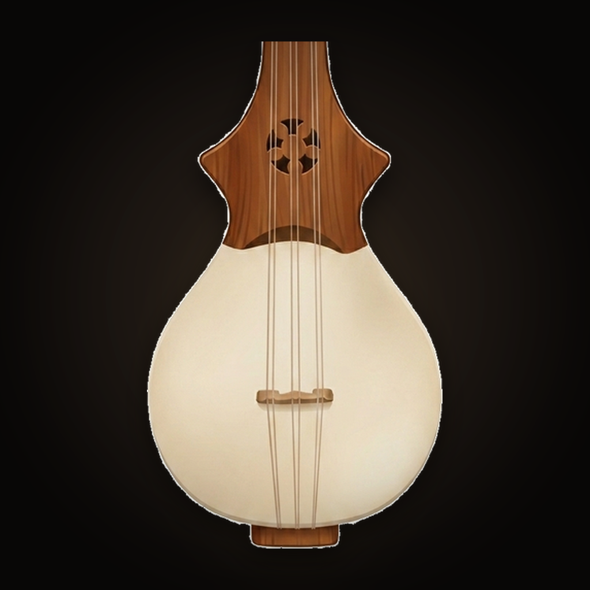

<div align="center">
  
  <h1>Dranyen</h1>
  <p><em>A professional listening tuner for the <strong>dranyen</strong>, the Tibetan lute.</em></p>
  <p>A project of the <strong>Terma Heritage Foundation</strong>.</p>
</div>

---

The dranyen is the heart of Tibetan folk music, but it is rarely taught with
written notation and almost never with modern tools. **Dranyen** is the first
piece of a small ecosystem built to keep the instrument — and the music made on
it — alive and learnable, for seasoned players and complete beginners alike.

This is a native iOS + Android app built to feel like a real instrument tuner:
fast, sensitive, and steady.

## What it does

### Tuner (the home screen)
- **Listens** through the microphone and shows the note you're playing — one of
  the seven dranyen degrees (Do · Re · Mi · Fa · So · La · Ti) — on a smooth
  analog dial that turns **green with a haptic tick** when you're in tune.
- **Holds your last pluck** on screen for a moment so you can read it after the
  string fades.
- **Free mode** simply names the note; tap **La · Re · So** to lock onto a course
  and get *tighten / loosen* guidance toward it.
- **Calibration** — nudge concert pitch (432 · 440 · 442 and between), or
  *“tune to your own La”*: pluck the La you like and Re and So follow from it,
  the traditional by-ear way.

### Learn
- An offline reading section with cited articles condensed from the Terma
  Heritage knowledge base (principally Tashi Tenzin, *Dranyen: A Study in
  Tibetan Identity*). Reachable from the book icon on the tuner.

### Player *(in progress)*
- A hidden, playable dranyen — a quiet entry point from the tuner — built on the
  real recorded note samples in `assets/audio/`. Behind an easter-egg dot while
  it matures.

## The tuning

D major, A = 440 Hz, confirmed with a master player and verified against
recordings. The three open courses are **La · Re · So**; So and La are
*re-entrant* — they sound an octave below the rest.

| Degree | Solfège | Pitch | Open course |
|:------:|:-------:|:-----:|:-----------:|
| 1 | Do | D3 (146.83 Hz) | |
| 2 | Re | E3 (164.81 Hz) | ● |
| 3 | Mi | F♯3 (185.00 Hz) | |
| 4 | Fa | G3 (196.00 Hz) | |
| 5 | So | A2 (110.00 Hz) | ● *(re-entrant)* |
| 6 | La | B2 (123.47 Hz) | ● *(re-entrant)* |
| 7 | Ti | C♯3 (138.59 Hz) | |

## How it's built

- **Flutter** — one codebase → iOS + Android. Organized by feature under
  `lib/features/` (`tuner`, `learn`, `player`) with shared code in `lib/shared/`.
- Pitch detection: **YIN** (`lib/shared/pitch/pitch_detector.dart`) — steady at
  the low So/La pitches and sensitive to soft playing.
- **One-Euro filter** (`lib/shared/pitch/one_euro_filter.dart`) — a needle that's
  snappy when moving and rock-steady when held; octave-guarded.
- The tuner engine and its mic/UI glue live in
  `lib/features/tuner/tuner_engine.dart` and `tuner_controller.dart`.
  Calibration is a single `tuningScale` factor on the engine.
- The analog dial is a `CustomPaint` in `lib/features/tuner/arc_gauge.dart`.
- Mic capture via `record`; sample playback via `flutter_soloud`; keep-awake via
  `wakelock_plus`.

## Develop

```sh
flutter pub get
flutter test       # engine + widget tests
flutter analyze
flutter run        # on a connected device
```

Brand assets (icon + splashes) are generated from the master render by
`assets/branding/build_brand.py`.

## Build & release

- **CI** (`.github/workflows/ci.yml`) analyzes, tests, and builds the Android
  APK on every push, and compiles the iOS app on a macOS runner.
- **iOS → TestFlight** (`.github/workflows/testflight.yml`, manual) signs and
  uploads a build for internal testing via the App Store Connect API.

> **Naming note:** the brand is **“Dranyen.”** The native store identifiers are
> intentionally kept as the original `net.termaheritage.dramnyen*` bundle IDs so
> the existing App Store / TestFlight record stays valid — only the display name
> and listing are user-visible.

## License & attribution

© Terma Heritage Foundation. The instrument artwork and tuning data are part of
the foundation's cultural-preservation work. All rights reserved unless noted
otherwise.
